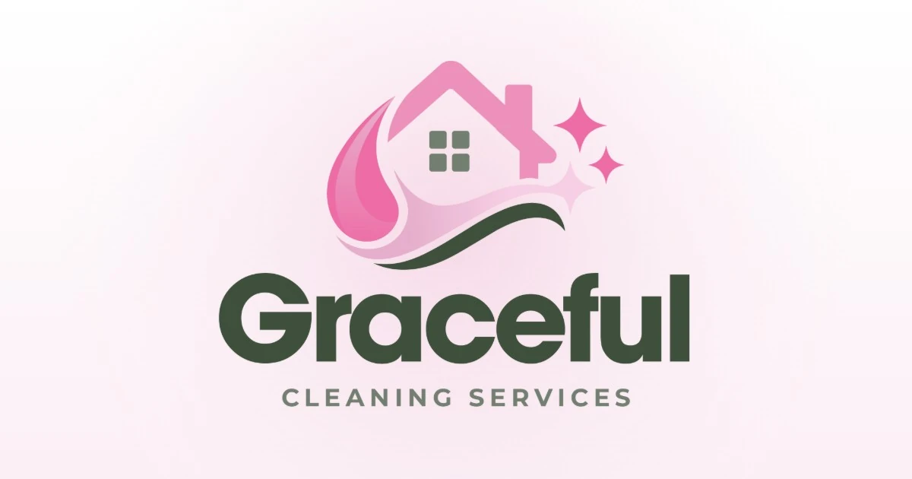

<div align="center">



# Graceful Cleaning Services

**Site one-page de uma empresa de limpeza residencial e comercial em Framingham, Massachusetts.**
Feito para quem chega pelo celular, vindo do Google e do Meta Ads, e quer pedir um orçamento em poucos toques.


[Ambiente de testes](https://graceful.escolats.com.br) · [Estrutura](#-estrutura) · [Rodar localmente](#-rodar-localmente) · [Publicar](#-publicar-na-hostinger)

</div>

---

## ✦ Sobre

Página única, em inglês, para o público americano da Graceful Cleaning Services. O objetivo é um só: o visitante entender a oferta em segundos, confiar na empresa e pedir um orçamento pelo formulário, por mensagem de texto ou por ligação.

Não tem framework, dependência nem etapa de build. São três arquivos de código (`index.html`, `styles.css`, `main.js`) e as imagens.

## ✦ Destaques

| | |
|---|---|
| **Hero em tela cheia** | Foto sob véu verde, tipografia mista (script + condensada) e uma faixa inclinada em loop com as promessas da marca. Sempre ocupa 100% da altura, do notebook ao monitor. |
| **Serviços em bento** | Cinco cards com foto, com o serviço principal em destaque e ícones Phosphor em duotone. |
| **Antes e depois** | Comparador arrastável por cômodo (cozinha, banheiro, sala), que funciona com mouse, toque e teclado. |
| **Orçamento em 3 passos** | Validação por etapa, máscara de telefone americano `(508) 395-9441`, foco e anúncios para leitores de tela a cada passo. |
| **Mobile primeiro** | Barra fixa *Text · Call · Book Now*, áreas de toque de 44px e textos a partir de 14px. |
| **Acessível** | Skip link, foco visível, contraste revisado e respeito a `prefers-reduced-motion`. |
| **Pronto para hospedar** | `.htaccess` com 404 própria, cache, compressão e bloqueio de indexação só no ambiente de testes. |

## ✦ Identidade

**Cores**


O rosa `#EC6FA7` é decorativo (brilhos e detalhes). Em botões e links usamos `#C83C7D`, que tem contraste de 4,7:1 sobre branco.

**Tipografia** (Google Fonts)

| Fonte | Uso |
|---|---|
| **Sora** | Títulos |
| **Figtree** | Textos e interface |
| **Anton** | Títulos condensados em destaque |
| **Kaushan Script** | Palavras em script sobrepostas |
| **Space Mono** | Rótulos pequenos |

## ✦ Estrutura

```
.
├── index.html            # o site
├── 404.html              # página de erro no mesmo estilo
├── assets/
│   ├── css/styles.css    # todo o visual (tokens em :root)
│   ├── js/main.js        # interações, comparador e formulário
│   ├── img/              # fotos em WebP + og-image
│   └── logo/             # logos e ícones (favicon, apple-touch)
├── .htaccess             # 404, cache, compressão, noindex do staging
├── robots.txt            # produção
├── robots-staging.txt    # servido como robots.txt só no staging
└── sitemap.xml
```

## ✦ Rodar localmente

Qualquer servidor estático serve. Dentro da pasta do projeto:

```bash
npx serve .
# ou
python -m http.server 8000
```

Abra `http://localhost:3000` (ou `:8000`). O `index.html` também abre direto do disco, com dois cliques.

## ✦ Publicar na Hostinger

1. Envie todo o conteúdo da pasta para o `public_html` do domínio, incluindo o `.htaccess` (no Windows ele fica oculto).
2. No hPanel, ative **Force HTTPS**.
3. Confira:
   - `/qualquer-coisa` mostra a 404 da Graceful;
   - no staging, `/robots.txt` mostra `Disallow: /`.

O ambiente de testes (`graceful.escolats.com.br`) recebe automaticamente `X-Robots-Tag: noindex` e o `robots.txt` bloqueado. No domínio final, nada disso se aplica, então não é preciso mexer no `.htaccess` ao publicar.

## ✦ Configuração

| O quê | Onde |
|---|---|
| **Envio do formulário** | Crie uma chave gratuita no [Web3Forms](https://web3forms.com) e troque `YOUR_WEB3FORMS_ACCESS_KEY` no `index.html`. Sem a chave, o formulário pede para o visitante mandar mensagem. |
| **Domínio final** | Troque `https://graceful.escolats.com.br` no topo do `index.html` (`canonical`, `og:url`, `og:image`, `twitter:image`), no `robots.txt` e no `sitemap.xml`. |
| **Antes e depois** | Pares de fotos por cômodo em `assets/js/main.js`, no objeto `ROOMS`. |
| **Fotos** | Substitua os arquivos em `assets/img/` mantendo os nomes, e atualize o `alt` no HTML. |
| **Cache** | Ao alterar CSS ou JS, mude o `?v=` nos links de `index.html` e `404.html`. O servidor guarda esses arquivos em cache por um ano. |

## ✦ Créditos

- **Desenvolvimento:** [Eu Sou TS](https://eusouts.com.br/)
- **Ícones de serviço:** [Phosphor Icons](https://phosphoricons.com) (MIT)
- **Fontes:** Google Fonts (SIL Open Font License)

---

<div align="center">
<sub>© 2026 Graceful Cleaning Services. Todos os direitos reservados. Código e marca não podem ser reutilizados sem autorização.</sub>
</div>
